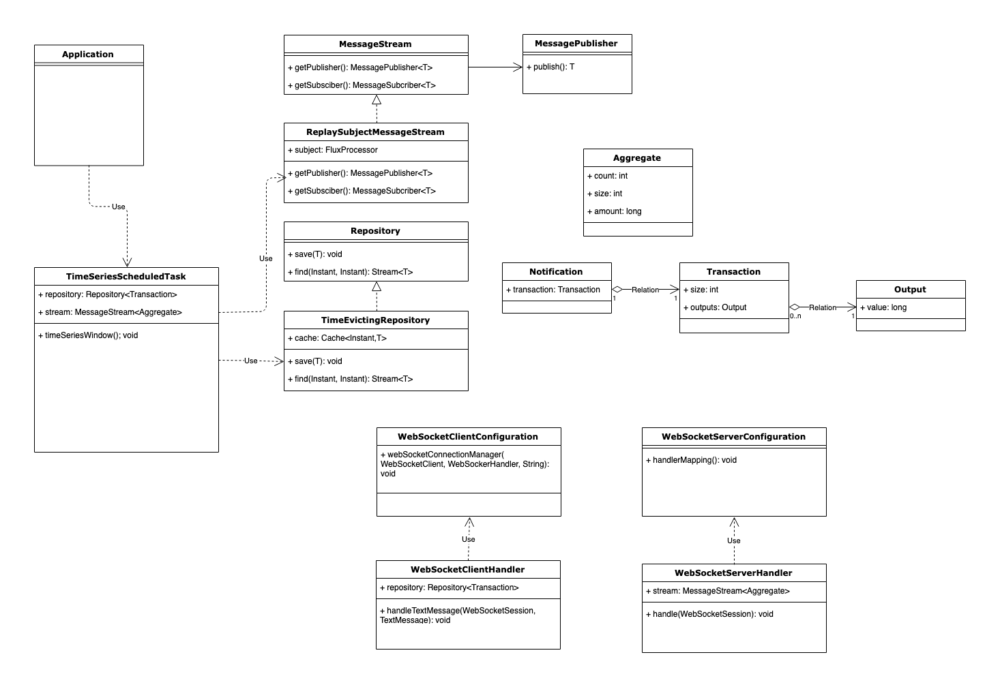

## Blockchain.info

### Description

Consume unconfimed bitcoin transactions from blockchain.info and expose a reactive websocket server which aggregates a time-series of unconfirmed transactions per minute.

### Design

The current solution has been implemented following an hexagonal architecute pattern.

The core domain is isolated from outer layers which include adapters to connect to external providers (i.e. blockchain.info websocket) or exposing data to third party consumers.

Dependency injection is used to instantiate infrastructure components (repositories and message streams) in runtime.

```
NOTE: for the sake of simplicity the repository is implemented using a self-evicting in-memory map and the message bus is a reactive FluxProcessor.
```

### Structure

* blockchain-info-aggregation-stream-adapter: websocket client and server handlers
* blockchain-info-aggregation-stream-client-example: springboot example websocket client application
* blockchain-info-aggregation-stream-domain: core domain entities
* blockchain-info-aggregation-stream-infrastructure: repository and stream (pubsub) implementation
* blockchain-info-aggregation-stream-runtime: springboot server application

### UML Diagram




### Next steps

* Domain object serialization and de-serialization should be moved to Data Transfer Objects (DTOs). Mapping to domain entities is 1:1 so this has been de-prioritized now.
* Behavioural testing (BDD) using `Cucumber` and `Gherkin` language.


### Requirements

* Java 12
* Apache Maven


### How-to build

```
mvn package
```

### How-to run

#### Backend application

```
java -jar ./blockchain-info-aggregation-stream-runtime/target/blockchain-info-aggregation-stream-runtime-0.0.1-SNAPSHOT.spring-boot.jar
```


#### Example client application

```
java -jar ./blockchain-info-aggregation-stream-client-example/target/blockchain-info-aggregation-stream-client-example-0.0.1-SNAPSHOT.spring-boot.jar
```


